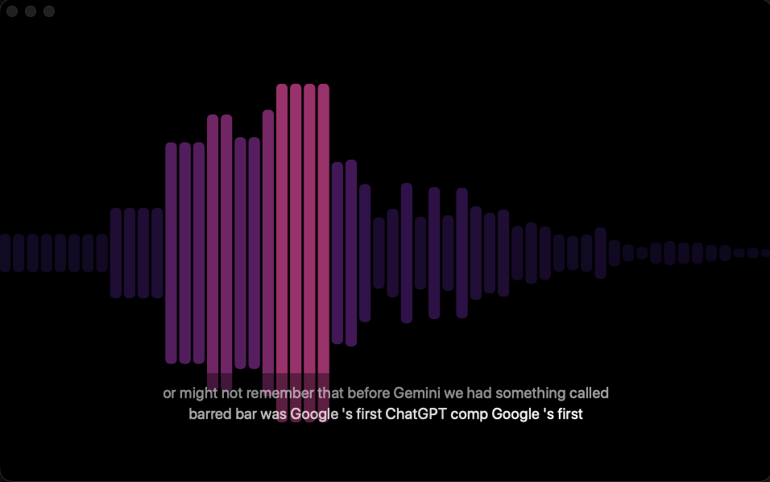

# Echoform

[](https://github.com/bryanlabs/echoform/actions/workflows/ci.yml)
[](LICENSE)
[](#requirements)
[](https://swift.org)

Echoform is a macOS app that turns whatever audio is playing on your Mac into
a calm, beautiful visualization. It taps your system audio output and renders
it as ambient, audio-reactive visuals, so whatever you are listening to
(music, a podcast, an audiobook, a call) you have something gentle to look at
instead of reaching for a feed, a game, or another screen.

It is built to hold your eyes without taking your attention: ambient, not
interactive; glanceable, not readable; audio-reactive, not content-competing.
The point is visual interest while you listen, not a second task.



*Bars mode with the Cyberpunk theme and on-device captions.*

## What it does

- Captures whatever is playing through the system audio output, locally.
- Renders it as one of six calm visual modes (bars, waveform, spectral heat,
  pulse field, flow field, or a combined view).
- Optionally shows a delayed caption layer, with optional on-device translation
  between a dozen major languages.
- Themeable, full-screen capable, and adjustable from a right-click menu.

Nothing is recorded or saved. The visualizer itself makes no network calls.
When captions are enabled, Apple Speech may use online recognition for
languages without a local model unless **On-device Only** is turned on.

## Requirements

- macOS 15 or later (built and tested on macOS 26).
- To build from source: Xcode 26 with the Swift 6.2 toolchain.

## Build and install

Building from source is the recommended way to run Echoform. You can read
every line first, and a build you compiled yourself is not quarantined, so it
opens with no Gatekeeper prompt (see "Permissions and trust" below).

```sh
git clone https://github.com/bryanlabs/echoform.git
cd echoform
./Scripts/install.sh
```

This builds `Echoform.app`, installs it to `/Applications`, and installs an
`echoform` launcher into `~/bin`. The build is ad-hoc signed. If you have an
Apple Development certificate it is used automatically instead, which keeps
macOS from re-asking for Screen Recording access on every rebuild.

- `./Scripts/package-app.sh` builds the app into `dist/` without installing.
- `./Scripts/make-icon.sh` regenerates the app icon.

## First run: grant Screen Recording access

macOS routes system audio through the Screen Recording permission, so
ScreenCaptureKit (which Echoform uses to capture audio) needs it even though
Echoform only ever captures audio, never video.

1. Launch Echoform. It shows a permission screen.
2. Click **Open System Settings** (or open System Settings ›
   Privacy & Security › Screen Recording).
3. Enable **Echoform** in the list, and authenticate when macOS asks.
4. Quit and reopen Echoform.

macOS remembers the grant, so you only do this once.

## Controls

Right-click anywhere on the visualizer to open the main controls menu. It
includes visual mode, theme, brightness, intensity, captions, spoken language,
translation target, recognition mode, and caption sync offset.

Keyboard shortcuts remain available as optional accelerators:

| Key      | Action                            |
|----------|-----------------------------------|
| `1`-`6`  | Switch visual mode                |
| `Space`  | Pause / resume                    |
| `F`      | Toggle full screen                |
| `Esc`    | Leave full screen                 |
| `[` `]`  | Decrease / increase intensity     |
| `B`      | Cycle brightness                  |
| `←` `→`  | Cycle theme                       |
| `C`      | Open the theme / color panel      |
| `T`      | Toggle captions                   |
| `L`      | Open the captions panel           |
| `,` `.`  | Decrease / increase sync offset   |
| `Cmd+Q`  | Quit                              |

## Visual modes

1. **Bars.** Symmetric loudness and frequency bars.
2. **Wave Ribbon.** A smooth, glowing waveform ribbon.
3. **Spectral Heat.** A slow-scrolling spectrogram.
4. **Pulse Field.** Breathing shapes driven by loudness and bass.
5. **Flow Field.** A slowly flowing vector field shaped by mids and treble.
6. **Combined.** Heat, pulse, and bars layered into one ambient view.

## Captions and the delay

Right-click and enable **Captions** to show a calm, low-contrast text layer in
the lower window. Pick **Spoken Language** and, if useful, enable **Translate**
and choose **Translate To**.

Recognition runs behind the audio, so **Caption Sync Offset** in the right-click
menu lets you tune the relationship between the captions and the visualizer
from -2 to +10 seconds. Negative offsets are useful for small timing nudges,
such as -0.33s. Positive offsets hold back the visualizer so captions and bars
can line up, but they do not delay what you hear.

Echoform currently observes system audio through ScreenCaptureKit. It does not
act as an output device and does not route audio onward to your speakers. That
means a negative caption offset cannot show a word before the speech recognizer
has emitted it. To make heard audio itself wait for captions, Echoform would
need a route-through audio mode built around a virtual output device or audio
driver.

With translation on, stable chunks of continuous speech are recognized in the
spoken language and then translated on-device before they appear, so you can,
for example, follow a Spanish or Korean source as English captions. Translation
uses Apple's Translation framework; the first time you use a language pair,
macOS downloads that pair once.

**On-device Only** is off by default so languages without installed local speech
models still work through Apple's online speech recognition. Turn it on if you
want to force local recognition only.

## Themes

Use the right-click **Theme** menu to pick Classic, Cyberpunk (pink and
purple), Aurora (greens), Ember (warm reds), or Custom. The **Custom Colors**
menu item opens the color panel with preset swatches and three color wells.

## Preview mode

To see the visuals without playing audio and without granting any permission:

```sh
echoform --demo
```

Add `--text` to start with the caption layer on. Demo mode feeds a synthetic
signal through the renderer, useful for trying modes, themes, and brightness.

## Permissions and trust

Echoform asks for two macOS permissions, and only those two.

- **Screen Recording.** macOS routes system-audio capture through the Screen
  Recording permission, so ScreenCaptureKit needs it. Echoform uses it only to
  read the audio that is already playing. It never captures, shows, or saves
  the screen or any video. Granting it is a one-time step (see "First run").
- **Speech Recognition.** Requested only when you turn captions on. By default
  Echoform allows Apple's online recognition for languages without an installed
  local model, which makes Spanish, Korean, and other languages work without
  extra model setup. Turn on **On-device Only** in the right-click menu if you
  want to force local recognition.

Echoform itself makes no network calls and never records, saves, or uploads
audio, transcripts, or anything else. Audio is analyzed in memory in real time
and then discarded. The exceptions are Apple-provided system services: macOS may
download a translation language pack the first time you pick a new pair, and
Apple Speech may use online recognition when **On-device Only** is off.

### Why there is no notarized download

An app that opens with no warning on any Mac has to be notarized by Apple,
which requires a paid Apple Developer Program membership. Echoform is a free,
zero-budget project and is not enrolled, so it is not notarized.

That is why building from source is the recommended path: the whole app is in
this repository, you can audit it, and a build you compiled locally is not
quarantined, so it opens with no Gatekeeper prompt.

If a release attaches a pre-built `Echoform.app`, macOS blocks it on first
launch because it is not notarized. To open it anyway, launch it once, then
open System Settings › Privacy & Security, find the note about Echoform being
blocked, and click **Open Anyway**. Or clear the download quarantine first:

```sh
xattr -dr com.apple.quarantine /path/to/Echoform.app
```

## Project layout

- `Sources/EchoformKit/` is the engine library: capture, analysis, observable
  state, speech, and the SwiftUI renderers.
- `Sources/Echoform/` is the app entry point.
- `Tests/EchoformKitTests/` holds unit tests for the analysis layer.
- `Scripts/` holds the build, sign, install, icon, and transcription benchmark
  scripts.

## Transcription benchmarks

Use `Scripts/benchmark-transcribers.py` to compare candidate caption engines on
the same audio file. It runs Parakeet locally and can run xAI Grok STT or Groq
Whisper when `XAI_API_KEY` or `GROQ_API_KEY` is present in the environment.

```sh
Scripts/benchmark-transcribers.py sample.wav --language es --repeat 3
```

See `docs/transcription-benchmarks.md` for the latest local benchmark notes.

## License

MIT. See [LICENSE](LICENSE).
